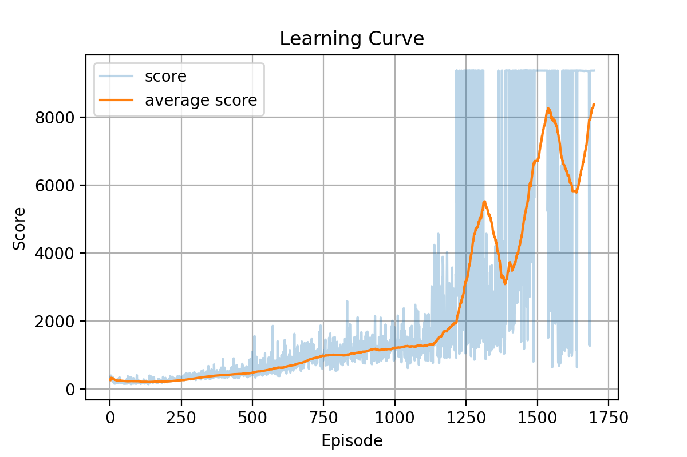
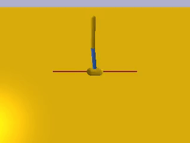

# SAC with PyTorch

This repo contains a PyTorch implementation of the Deep Reinforcement Learning algorithm Soft Actor Critic (SAC), as described in the paper [Soft Actor-Critic: Off-Policy Maximum Entropy Deep Reinforcement Learning with a Stochastic Actor](https://arxiv.org/abs/1801.01290) (2018)

You can see below the learning curves along with gifs of SAC agents (trained with this code) play the Inverted Double Pendulum and Inverted Pendulum Swing environments of PyBullet.

 


 


## Requirements
|Library         | Version |
|----------------|---------|
|`Python`        |  `3.8`  |
|`torch`         |  `1.8.1`|
|`gym`           | `0.18.3`|
|`numpy`         | `1.19.5`|
|`pybullet`      | `3.21`  |


## Folders and Files Description

### Folders

|Folder name       |                     Description                                    |
|------------------|--------------------------------------------------------------------|
|`src`             | All `.py` sourch files                                             |
|`tmp `            | A temporary file for results savings                               |
|`assets`          | Non-code related files like videos, pictures, etc                 |


### Files

|File name         |                     Description                                    |
|------------------|--------------------------------------------------------------------|
|`main.py`         | General main application for training/playing a SAC based agent    |
|`agents.py`       | Containing the SAc agent class                                     |
|`networks.py`     | Networks in used by agents (Actor, Critic and Value networks)      |
|`utils.py`        | General utility functions                                          |
|`buffer.py`       | A replay buffer class, used for offline training                   |


## Command Line API

You should run the `main.py` file with the following arguments:


|Argument             | Description                                                                                   |
|---------------------|-----------------------------------------------------------------------------------------------|
|`-play`              | Choosing the mode of the agent, False for learning or True for playing and render to screen   |
|`-gamma`             | Discount factor for the update rule, default=0.99                                             |
|`-alpha`             | The Actor network learning rate                                                               |
|`-beta`              | The Critic and Value networks learning rate                                                   |
|`-fc1_dim`           | The dimension of the first Linear layer across all networks                                   |
|`-fc2_dim`           | The dimension of the second Linear layer across all networks                                  |
|`-memory_size`       | The Replay Buffer memory size                                                                 |
|`-batch_size`        | The batch size                                                                                |
|`-tau`               | The parameters update constant -- 1 for hard update, 0 for no update                          |
|`-update_period`     | The period for updating the networks weights                                                  |
|`-reward_scale`      | The scale factor for the rewards as written in the paper (exploration/exploitation parameter) |
|`-warmup`            | Number of transitions passes before learning starts                                           |
|`-reparam_noise_lim` | Lower limit of the reparametrization noise (the upper limit is hardcoded to 1.)               |
|`-n_games`           | Number of games / episodes                                                                    |
|`-env_name`          | The environment name, PyBullet or Gym (see notes below)                                       |
|`-load_checkpoint`   | Load a model checkpoint, default=False                                                        |
|`-gpu_to_cpu`        | Load to a CPU a model that was trained on a GPU, set to True, else False                      |
|`-dir`               | Path for loading and saving models and plots                                                  |
|`-monitor`           | If True, a video is being saved for each episode (only if the ffmpeg package is installs)     |


## Training and Playing
- Training a SAC agent on the *InvertedDoublePendulumBulletEnv-v0* environment with defualt arguments as stated in the SAC paper [1]

```text
python3 main.py
``` 
- Training a SAC agent on the *InvertedPendulumBulletEnv-v0* for 400 games with memory buffer size of 10000, batch size of 32 and warmup of 300 learning steps

```text
python3 main.py -memory_size 10000 -batch_size 32 -warmup 300 -n_games 400 -env_name InvertedDoublePendulumBulletEnv-v0
``` 

- Training a SAC agent from checkpoint for 100 games

```text
python3 main.py -n_games 400 -load_checkpoint True
``` 

- Playing a single game of *InvertedPendulumBulletEnv-v0* (and render it to the screen) with an untrained agent 

```text
python3 main.py -n_games 1 -play True -env_name InvertedPendulumBulletEnv-v0
```

- Playing 5 games of *InvertedDoublePendulumBulletEnv-v0* with a trained agent and save the video

```text
python3 main.py -n_games 5 -monitor True -play True -load_checkpoint True -env_name InvertedDoublePendulumBulletEnv-v0
```

### Notes
1. In order to load a saved checkpoint, the networks should be in the `tmp\name_of_env` directory, with the next names: Actor, Critic_1, Critic_2, Value and Target_Value.
2. For some reason the PyBullet environmets do not work when called with PyBullet instead of Bullet (i.e. use `InvertedDoublePendulumBulletEnv-v0` and not `InvertedDoublePendulumPyBulletEnv-v0`).
3. The current networks for the environments in the `tmp` folder belong to trained agents. You can play with them by running the next code in comman line 
```text
python3 main.py -n_games 5 -play True -load_checkpoint True -gpu_to_cpy True -env_name InvertedDoublePendulumBulletEnv-v0
```

```text
python3 main.py -n_games 5 -play True -load_checkpoint True -gpu_to_cpy True -env_name InvertedPendulumSwingupBulletEnv-v0
```


## Reference

[1]  [Soft Actor-Critic: Off-Policy Maximum Entropy Deep Reinforcement Learning with a Stochastic Actor](https://arxiv.org/abs/1801.01290) (2018)

[2]  [Modern Reinforcement Learning: Actor Critic algorithms Course - Phil Tabor](https://www.udemy.com/course/actor-critic-methods-from-paper-to-code-with-pytorch/) (great comprehensive course about Actor Critic algorithms)


 

 
